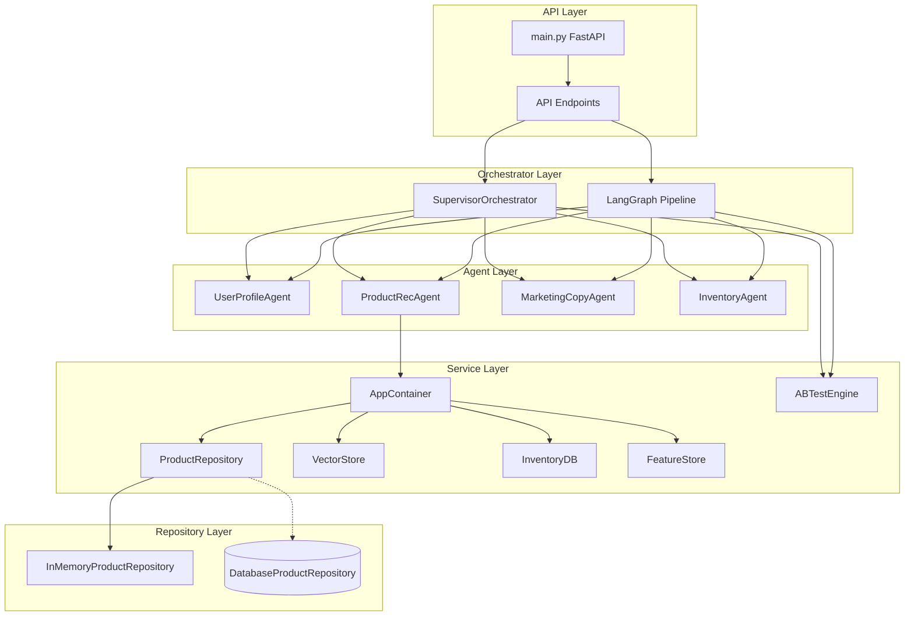

# 系统架构文档

## C4 Level 2 - 组件图



## 模块依赖关系

```
main.py
├── containers/
│   └── AppContainer
│       ├── repositories/
│       │   ├── ProductRepository (抽象)
│       │   └── InMemoryProductRepository (实现)
│       └── services/
│           ├── VectorStore
│           ├── InventoryDB
│           └── FeatureStore
├── orchestrator/
│   ├── SupervisorOrchestrator
│   └── graph.py (LangGraph)
├── agents/
│   ├── ProductRecAgent
│   ├── UserProfileAgent
│   ├── MarketingCopyAgent
│   └── InventoryAgent
└── services/
    └── ABTestEngine
```

## 数据流架构

### 推荐流程 (Supervisor 模式)

```
用户请求
   │
   ▼
┌─────────────────────────────────────┐
│  Phase 1: 并行执行                   │
│  ├─ UserProfileAgent → 用户画像      │
│  └─ ProductRecAgent → 候选商品召回   │
└─────────────────────────────────────┘
   │
   ▼
┌─────────────────────────────────────┐
│  Phase 2: 并行执行                   │
│  ├─ ProductRecAgent → LLM 重排       │
│  └─ InventoryAgent → 库存过滤        │
└─────────────────────────────────────┘
   │
   ▼
┌─────────────────────────────────────┐
│  Phase 3: 营销文案生成               │
│  └─ MarketingCopyAgent → 文案生成    │
└─────────────────────────────────────┘
   │
   ▼
推荐结果 (含 explain 字段)
```

### 数据源切换流程

```
┌─────────────────────────────────────────────┐
│  当前状态 (开发/降级模式)                    │
│  - ProductRepository → InMemoryProductRepo  │
│  - VectorStore → 返回空列表 (降级)           │
│  - InventoryDB → 假设全部有货 (降级)         │
│  - FeatureStore → 内存模式 (无 Redis)        │
└─────────────────────────────────────────────┘
                  │
                  │ 生产环境配置
                  ▼
┌─────────────────────────────────────────────┐
│  生产状态                                    │
│  - ProductRepository → DatabaseProductRepo  │
│  - VectorStore → Milvus 客户端               │
│  - InventoryDB → MySQL/PostgreSQL            │
│  - FeatureStore → Redis 客户端               │
└─────────────────────────────────────────────┘
```

## 核心设计模式

### 1. 仓库模式 (Repository Pattern)

```python
# 抽象层
class ProductRepository(ABC):
    async def get_by_ids(self, ids: list[str]) -> list[Product]: ...
    async def get_by_category(self, category: str, limit: int) -> list[Product]: ...

# 内存实现 (开发/降级)
class InMemoryProductRepository(ProductRepository):
    # 使用 Mock 数据

# 数据库实现 (生产)
class DatabaseProductRepository(ProductRepository):
    # 调用真实数据库
```

### 2. 依赖注入 (Dependency Injection)

```python
class AppContainer:
    """统一依赖注入容器"""
    
    @property
    def product_repo(self) -> ProductRepository:
        if self._product_repo is None:
            self._product_repo = InMemoryProductRepository()
        return self._product_repo
    
    @property
    def vector_store(self) -> VectorStore:
        if self._vector_store is None:
            self._vector_store = VectorStore(milvus_client=None)
        return self._vector_store
```

### 3. 策略模式 (召回策略)

```python
async def _recall(self, profile, limit):
    # 策略 1: 向量召回
    if self.vector_store.is_available():
        candidates.extend(await vector_search())
    
    # 策略 2: 类目召回
    if profile.preferred_categories:
        candidates.extend(await category_search())
    
    # 策略 3: 热门兜底
    candidates.extend(await hot_products())
    
    return candidates
```

## 可解释性设计

每个推荐商品包含 `explain` 字段：

```json
{
  "product_id": "P001",
  "name": "iPhone 16 Pro",
  "explain": {
    "recall_source": "category",
    "matched_category": true,
    "price_matched": true,
    "matched_tags": ["旗舰", "新品"]
  }
}
```

## 降级策略

| 服务 | 降级行为 |
|------|----------|
| VectorStore | 返回空列表，上层用热门商品填充 |
| InventoryDB | 假设所有商品都有货 |
| FeatureStore | 使用内存模式，不存储实时特征 |
| LLM | 使用预设排序，不阻塞流程 |

## 测试策略

| 测试类型 | 覆盖内容 |
|---------|---------|
| 单元测试 | Repository、Container、Agent |
| 集成测试 | Supervisor 端到端流程 |
| 对齐测试 | Graph 与 Supervisor 输出一致性 |
